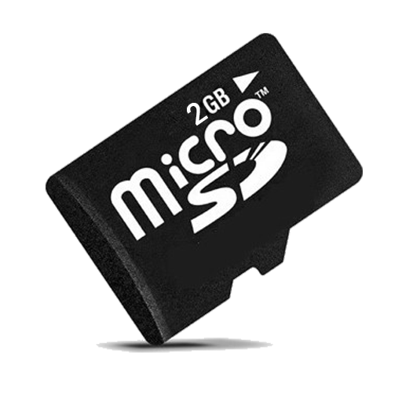
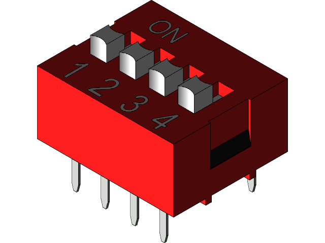

# TECTIJUANA
## MicroSD card y DIP Switch
### Mora Espinosa Michelle Guadalupe 19211691

Las tarjetas microSD, transflash o T-flash corresponden al formato de tarjeta de memoria flash más pequeña que la miniSD.
Fue desarrollada por SanDisk, y en julio de 2005 fue adoptada por la Asociación de Tarjetas SD con el nombre «microSD».
Mide tan solo 15×11×1 milímetros, con un área de 165 mm². Esto es tres y media veces menos que la tarjeta miniSD, que era, hasta la aparición de las microSD, el formato más pequeño de tarjetas SD, y tiene alrededor de un décimo del volumen de una tarjeta SD.

| **Tipo** |      **Capacidad**      |
|:--------:|:-----------------------:|
|    SD    | 2GB y menos             |
|   SDHC   | Más de 2GB, hasta 32 GB |
|   SDXC   | Más de 32GB, hasta 2TB  |
|   SDUC   | Más de 2TB, hasta 128TB |

Se trata de un conjunto de interruptores eléctricos que se presenta en un formato encapsulado (en lo que se denomina Dual In-line Package), la totalidad del paquete de interruptores se puede también referir como interruptor DIP en singular.
  Este tipo de interruptor se diseña para ser utilizado en un tablero similar al de circuito impreso junto con otros componentes electrónicos y se utiliza comúnmente para modificar o personalizar el comportamiento hardware de un dispositivo electrónico en ciertas situaciones específicas. 
  

|                                                            Características                                                           |
|:------------------------------------------------------------------------------------------------------------------------------------:|
| • Se diseña para ser utilizado en un tablero similar al circuito impreso junto con otros componentes electrónicos.                   |
| • Se utiliza comúnmente para modificar/personalizar el comportamiento hardware de un dispositivo electrónico en ciertas situaciones. |
| • Es una alternativa a los jumper (o puente, que permite conectar dos terminales de manera temporal).                                |
| • Es más rápido y fácil de configurar y cambiar, no hay piezas sueltas que perder.                                                   |
